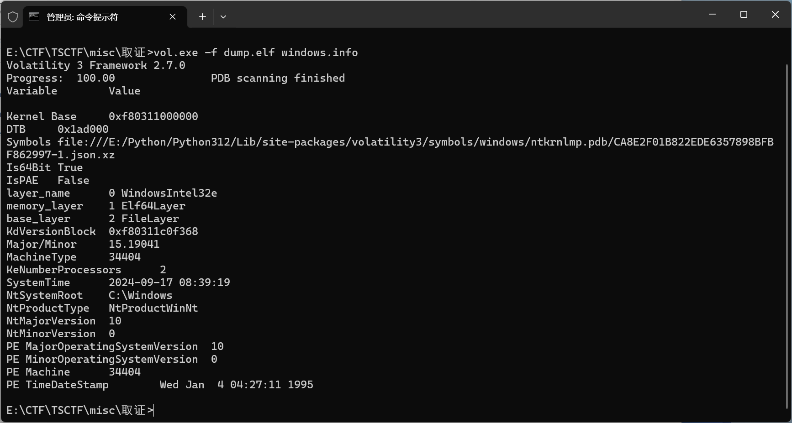
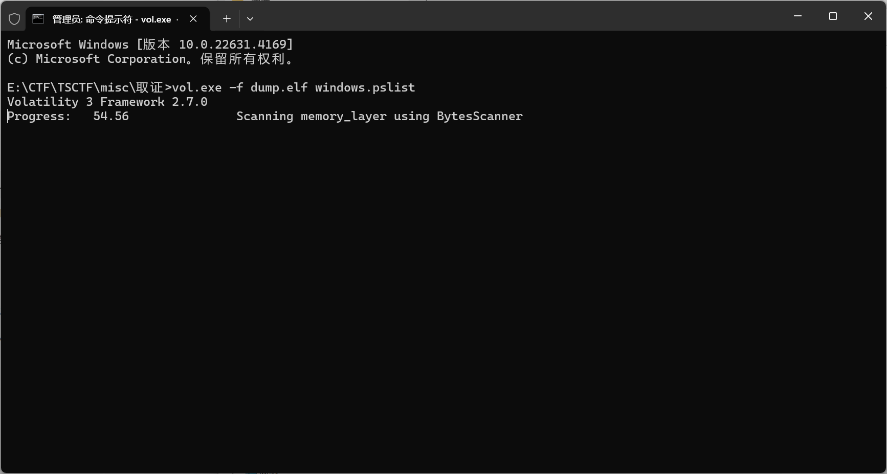
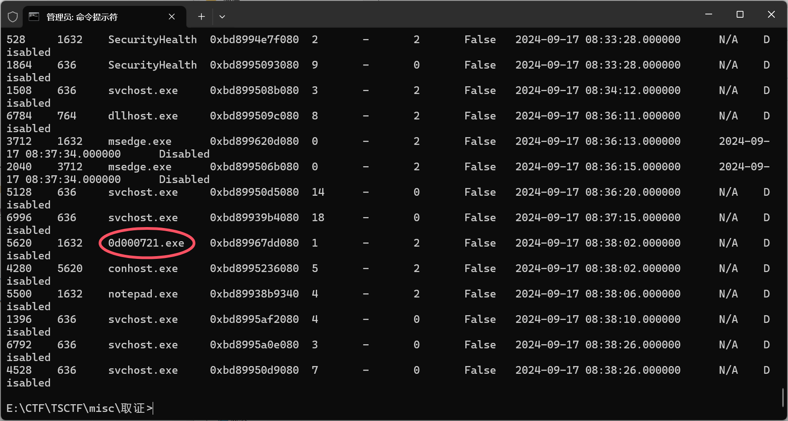

# TSCTF-J XiaoYuan Writeup

## MISC
---
### set set password
1. 单个数字之和必须等于 `25`，拿 `1`凑
1. 罗马数字的乘积必须为 `35`，直接输 `XXXV`
1. 验证码尽量刷出不含罗马数字和数字之和较小的
1. 元素符号的拿 `H`凑
1. 图寻直接一个国家一个国家试
1. 密码长度拿空格凑和0凑（刚好满足闰年）
1. 把系统时间设置成0:00避免25的问题

讲究一个暴力解决，说啥做啥，设置好密码就OK

---

### wordle
要赢100局肯定要找一个必胜策略，在开局的时候要尽可能的选择字母种数多的，而且字母的出现频率要高，可以排除更多的单词或确定更多的信息

直接贴源码
```python
import socket
import random
import json
import time
from collections import Counter

with open("5-letter-word.json", "r", encoding="utf-8") as f:
    word_list = json.load(f)
    # word_list = [word for word in word_list if len(word) == 5]
# with open("5-letter-word.json", "w", encoding="utf-8") as f:
#     json.dump(word_list, f)

def connect_to_wordle_server():
    """连接到Wordle服务器"""
    host = 'challenges.hazmat.buptmerak.cn'
    port = 21473
    sock = socket.socket(socket.AF_INET, socket.SOCK_STREAM)
    sock.connect((host, port))  # 连接到服务器
    return sock

class WordleSovler():
    def __init__(self, all_word):
        self.all_word = all_word
        self.possible = all_word
        self.presence = set()
        self.presence_letter = set()
        self.vague = set()
        self.absence = set()

    def update_dict(self, guess, feedback):
        for ind, letter in enumerate(guess):
            if feedback[ind] == "O":
                # print(f"{letter}确定")
                self.presence.add((letter,ind))
                self.presence_letter.add(letter)
            elif feedback[ind] == "-":
                # print(f"{letter}存在")
                self.vague.add((letter,ind))
                self.presence_letter.add(letter)
            elif feedback[ind] == "X" and letter not in self.presence_letter:
                # print(f"{letter}不存在")
                self.absence.add(letter)
        self.absence_copy = self.absence.copy()
        for letter in self.absence_copy:
            if letter in self.presence_letter:
                self.absence.remove(letter)
        # print(f"{self.presence=}")
        # print(f"{self.vague=}")
        # print(f"{self.absence=}")

    def is_contain_absence_letters(self, word):
        for c in word:
            if c in self.absence:
                return True
        return False

    def is_match_presence(self,word):
        for letter, index in self.presence:
            if word[index] != letter:
                return False
        return True

    def is_match_vague(self,word):
        for letter, index in self.vague:
            if word[index] == letter or letter not in word:
                return False
        return True

    def update_list(self):
        new_list = []
        for word in self.possible:
            if self.is_contain_absence_letters(word) or not self.is_match_presence(
                 word) or not self.is_match_vague(word):
                continue
            new_list.append(word)
        self.possible = new_list

    def get_untried(self,words):
        counter = Counter()
        tried = self.absence | self.presence_letter
        all_letter = set(chr(ord('a')+i) for i in range(26))
        untried = all_letter - tried
        for w in words:
            for c in w:
                if c in untried:
                    counter[c] += 1
        return counter
    
    def get_freq(self, words):
        counter = Counter()
        for w in words:
            for c in w:
                counter[c] += 1
        return counter

    def generator(self, attempt):
        # self.possible.sort(key=lambda x:-len(set(x)))
        # return random.choice(self.possible[:50])
        untried = self.get_untried(self.possible)
        freq = self.get_freq(self.possible)
        if len(untried) > 1 and attempt < 5:
            word_with_score = []
            word_list = self.all_word
            for word in word_list:
                letters = set(word)
                untried_score = sum(untried[c] if c in untried else 0 for c in letters)
                freq_score = sum(freq[c] if c in freq else 0 for c in letters)
                word_with_score.append((word,untried_score,freq_score))
            ranked_words = sorted(word_with_score,
                                  key=lambda item:(-item[1],-item[2],item[0]))
            guess = ranked_words[0][0]
        else:
            guess = \
                sorted(self.possible,
                       key=lambda word: (-len(set(word)), -sum(freq[c] for c in word), word))[0]
        return guess

    def update(self, guess, feedback):
        self.update_dict(guess, feedback)
        self.update_list()
        # print(f"after update:{len(self.possible)}")

    def reset(self):
        self.possible = self.all_word
        self.presence = set()
        self.presence_letter = set()
        self.vague = set()
        self.absence = set()

solver = WordleSovler(word_list)

def play_one_time(sock:socket, solver:WordleSovler,win):
    if win == 94:
        sock.sendall(b"every")
        print(f"msg:{sock.recv(4096).decode()}")    # round消息
        return True
    if win == 95:
        sock.sendall(b"smile")
        print(f"msg:{sock.recv(4096).decode()}")    # round消息
        return True
    if win == 96:
        sock.sendall(b"shows")
        print(f"msg:{sock.recv(4096).decode()}")    # round消息
        return True
    if win == 97:
        sock.sendall(b"great")
        print(f"msg:{sock.recv(4096).decode()}")    # round消息
        return True
    if win == 98:
        sock.sendall(b"power")
        print(f"msg:{sock.recv(4096).decode()}")    # round消息
        return True
    attempt = 0
    while attempt < 6:
        print(f"msg:{sock.recv(4096).decode()}")    # round消息
        guess = solver.generator(attempt)
        print(f"try:{guess}")
        sock.sendall(guess.encode())
        feedback = sock.recv(4096).decode().strip() #XXOO-
        print(feedback)
        # print(2)
        if "OOOOO" in feedback:
            return True
        if "You lost." in feedback:
            return False
        if "Word not found!" in feedback:
            try:
                solver.all_word.remove(guess)
                solver.possible.remove(guess)
            except Exception:
                pass
            continue
        solver.update(guess, feedback)
        attempt += 1


sock = connect_to_wordle_server()
feedback = sock.recv(4096).decode()
print(f"初次连接：\n{feedback}")
win = 0
try:
    while win < 100:
        print(f"{win=}")
        if play_one_time(sock, solver,win):
            solver.reset()
            win += 1
    print(f"msg:{sock.recv(4096).decode()}")    # 不要错过flag消息
    print(f"msg:{sock.recv(4096).decode()}")    # 不要错过flag消息
    print(f"msg:{sock.recv(4096).decode()}")    # 不要错过flag消息
    print(f"msg:{sock.recv(4096).decode()}")    # 不要错过flag消息
except Exception as e:
    print(f"error:{e}")
    sock.close()
```
---
### 学习资料 1-4
纯纯工具送分题
#### 1
内存镜像是 `.elf` 格式的，看了一下重新下了个volatility3，旧的不支持
用 `vol.exe` 查看镜像信息即得

#### 2
用 `vol.exe -f dump.elf windows.hashdump`得到了密码的hash，在线爆破得到密码提交flag
#### 3
`vol.exe -f dump.elf windows.pslist`查看进程


#### 4
`vol.exe -f dump.elf windows.filescan | findstr 'flag'`

中间因为路径中有 `\u` 的干扰，所以在volatility3中的`text_render.py`的那一块加了个`try-expect`

找到`flag.txt`之后用`vol.exe -f dump.elf windows.dumpfile`提取得到flag

---

### 学习资料5
流量分析题+一堆乱七八糟的东西
首先搭建一个MC服务器，登录到服务器，想到题干中的`还是说......这个世界的**规则**不一样？`想到**指令**

用 `/help` 一查看发现有个`/decodeblock`指令，用这个指令得到了`flag.pcapng`，但是用wireshark打不开，用winhex查看了文件头不是很常见，（找出题人要了个hint），说要用到java反编译，用jd-gui看到了插件的源码找到了问题所在
```java
for (int i = 0; i < data.length; i++)
        data[i] = (byte)(data[i] ^ 0xFF); 
      String base64String = Base64.getEncoder().encodeToString(data);
      return base64String.getBytes();
```
写了个脚本复原
```python
import base64
with open("flag.pcapng","rb") as f:
    data = f.read()
    data = base64.b64decode(data.decode())
    new_data = b""
    for i in range(len(data)):
        new_data += (data[i] ^ 0xFF).to_bytes(1,"big")
with open("flag_decoded.pcapng","wb") as f:
    f.write(new_data)
```
发现又打不开，再看发现是zip的文件头，改了后缀，解压发现要密码。刚开始就拉到最下面看了一眼发现了`Is password real?`的提示，刚开始还傻傻的试了`real`和`real?`，后来意识过来时伪加密，把标志位一改就解压出来了。

用`tshark -r flag.pcapng -T field -e usb.capdata >data.txt`提取出数据，在wireshark中分析了好久，应该是键盘数据，但是有0104的也有0100的，查了一下0104的是按住了右alt，0100应该就是松开了，自己试着跟着按了一下，发现打出中文字了。去查原理，发现Windows里面Alt+小键盘输入中文字符的gbk编码可以直接输出字符。立马开写脚本。
```python
with open("usbdata.txt", "r", encoding="utf-8") as f:
    data = f.readlines()

data = [i.strip() for i in data if i.strip()]
keys = [key[:8] for key in data]
vaild_keys = [key[-2:] for key in keys if (key[-2:] != "00" or key[:4] == "0100") ]
# print(keys)
print(vaild_keys)
mapping = {"59": "1","5a": "2","5b": "3","5c": "4",
    "5d": "5", "5e": "6","5f": "7","60": "8","61": "9",
    "62": "0"}
nums = []
num = ""
for key in vaild_keys:
    if key == "00":
        if num:
            nums.append(int(num))
            num = ""
    else:
        num += mapping[key]
print(nums)

def gbk_char_from_decimal(decimal_code):
    gbk_bytes = decimal_code.to_bytes(2, byteorder='big')
    char = gbk_bytes.decode('gbk')
    return char

chars = [gbk_char_from_decimal(num) for num in nums]

print(chars)

with open("decoded.txt", "w", encoding="utf-8") as f:
    f.write("".join(chars))
```

得到
`熊曰：呋食食出魚常住呱嗡和註誘嗄萌喜圖嗚果哞誘類圖家萌偶物冬噗誘哮洞取啽更雜住嘿嗷有呱性發歡洞捕捕哈洞嘶麼肉家嗥嚄果偶很冬我盜物物嚁囑呦嗄肉笨會告覺哞嗷取呆現喜笨寶噤肉冬`

想起宣讲会上说的，是与熊论道的编码，解了一下码得到`U2FsdGVkX18Zz1n2/ZeYSxuFpzOndISllRaiaHVfZ9NZfBC4YbUdCpCttVujDi5r`用`CyberChef`bake了一下发现加盐了（找出题人要了一下hint），在MC的告示牌里得到了密钥是`nothing`，解密AES得到flag

### 熟摩棍哥
读了题目立马想到摩斯电码。刚好整个音频里只有`冲`和`冲刺`

一开始把`冲`对应的`.`，发现有一个始终找不到对应，就换了一下`冲`对应到`-`就对了。翻译完看到`===`想到是被编码了，直接`CyberChef`解决。

## Web
### set set what(WEB 签到)
在公告里找到了出题人的QQ，把滑动条的max设置成出题人QQ，直接拉到最后得到了flag
